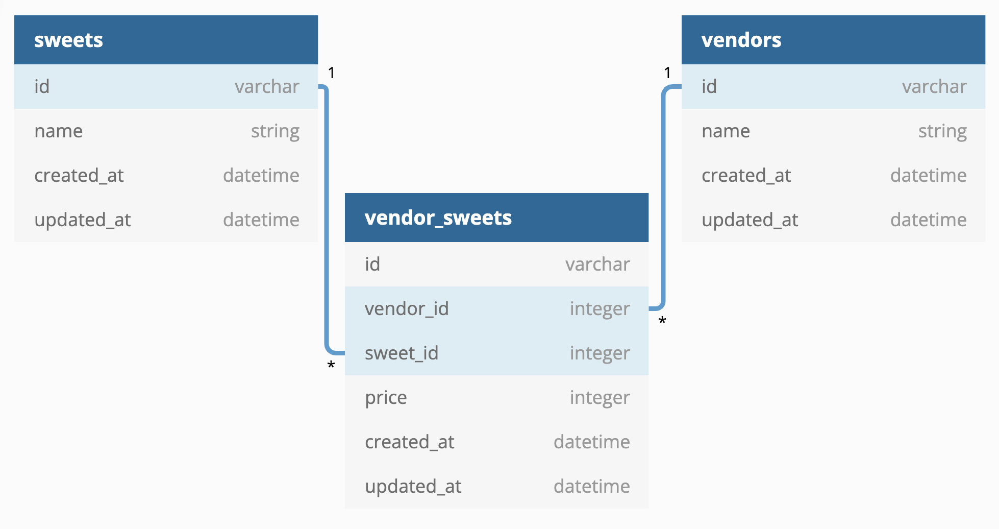

# Rails Code Challenge - Sweets Vendors

For this assessment, you'll be working with a vendors and sweets domain.

In this repo, there is a Rails application with some features built out. There
is also a fully built React frontend application, so you can test if your API is
working.

Your job is to build out the Rails API to add the functionality described in the
deliverables below.

## Setup

To download the dependencies for the frontend and backend, run:

```sh
bundle install
npm install --prefix client
```

There is some starter code in the `db/seeds.rb` file so that once you've
generated the models, you'll be able to create data to test your application.

You can run your Rails API on [`localhost:3000`](http://localhost:3000) by
running:

```sh
rails s
```

You can run your React app on [`localhost:4000`](http://localhost:4000) by
running:

```sh
npm start --prefix client
```

You are not being assessed on React, and you don't have to update any of the
React code; the frontend code is available just so that you can test out the
behavior of your API in a realistic setting.

There are also tests included which you can run using `rspec` to check your
work.

Depending on your preference, you can either check your progress by:

- Running `rspec` and seeing if your code passes the tests
- Running the React application in the browser and interacting with the API via
  the frontend
- Running the Rails server and using Postman to make requests

## Models

You need to create the following relationships:

- A `Vendor` has many `Sweet`s through `VendorSweet`
- A `Sweet` has many `Vendor`s through `VendorSweet`
- A `VendorSweet` belongs to a `Vendor` and belongs to a `Sweet`

Start by creating the models and migrations for the following database tables:

<!-- TODO: update diagram -->



If you use a Rails generator to create the models, make sure to use the
`--no-test-framework` flag to avoid overwriting the test files.

Add any code needed in the model files to establish the relationships.

Then, run the migrations and seed file:

```sh
rails db:migrate db:seed
```

> If you aren't able to get the provided seed file working, you are welcome to
> generate your own seed data to test the application.

## Validations

Add validations to the `VendorSweet` model:

- `price` cannot be blank
- `price` cannot be a negative number

## Routes

Set up the following routes. Make sure to return JSON data in the format
specified along with the appropriate HTTP verb.

### GET /vendors

Return JSON data in the format below:

```json
[
  { "id": 1, "name": "Insomnia Cookies" },
  { "id": 2, "name": "Cookies Cream" }
]
```

### GET /vendors/:id

If the `Vendor` exists, return JSON data in the format below:

```json
{
  "id": 1,
  "name": "Insomnia Cookies",
  "vendor_sweets": [
    {
      "id": 5,
      "name": "Chocolate Chip Cookies",
      "price": 200
    },
    {
      "id": 6,
      "name": "Chocolate Chunk Cookies",
      "price": 300
    }
  ]
}
```

If the `Vendor` does not exist, return the following JSON data, along with the
appropriate HTTP status code:

```json
{
  "error": "Vendor not found"
}
```

### GET /sweets

Return JSON data in the format below:

```json
[
  {
    "id": 1,
    "name": "Chocolate Chip Cookie"
  },
  {
    "id": 2,
    "name": "Chocolate Chunk Cookie"
  }
]
```

### GET /sweets/:id

If the `Sweet` exists, return JSON data in the format below:

```json
{
  "id": 1,
  "name": "Chocolate Chip Cookie"
}
```

If the `Sweet` does not exist, return the following JSON data, along with the
appropriate HTTP status code:

```json
{
  "error": "Sweet not found"
}
```

### POST /vendor_sweets

This route should create a new `VendorSweet` that is associated with an existing
`Vendor` and `Sweet`. It should accept an object with the following properties
in the body of the request:

```json
{
  "price": 300,
  "vendor_id": 1,
  "sweet_id": 3
}
```

If the `VendorSweet` is created successfully, send back a response with the
following data:

```json
{
  "id": 5,
  "name": "Chocolate Chip Cookies",
  "price": 300
}
```

If the `VendorSweet` is **not** created successfully, return the following JSON
data, along with the appropriate HTTP status code:

```json
{
  "errors": ["validation errors"]
}
```

### DELETE /vendor_sweets/:id

This route should delete an existing `VendorSweet`. If the `VendorSweet` exists
and is deleted successfully, return an empty object as a response:

```json
{}
```

If the `VendorSweet` does not exist, return the following JSON data, along with
the appropriate HTTP status code:

```json
{
  "error": "VendorSweet not found"
}
```
